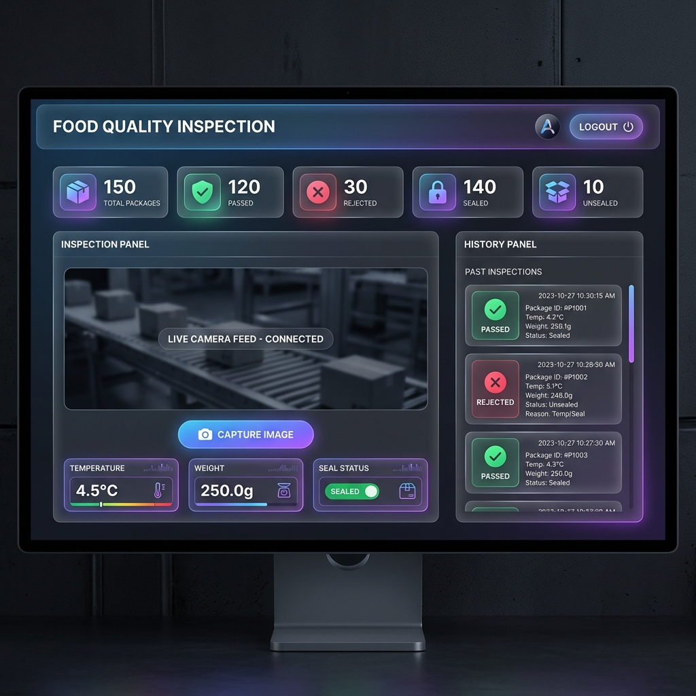

# 🍱 Smart Packaged Food Quality Inspection System

<div align="center">


**A Complete Full-Stack Web Application for Automated Food Quality Control**

[](https://reactjs.org/)
[](https://nodejs.org/)
[](https://www.mongodb.com/)
[](LICENSE)

</div>

---

## 📋 Table of Contents

- [Overview](#overview)
- [Features](#features)
- [Screenshots](#screenshots)
- [Technology Stack](#technology-stack)
- [Quick Start](#quick-start)
- [Project Structure](#project-structure)
- [Documentation](#documentation)
- [API Endpoints](#api-endpoints)
- [Quality Decision Logic](#quality-decision-logic)
- [Use Cases](#use-cases)
- [Future Enhancements](#future-enhancements)
- [Contributing](#contributing)
- [License](#license)

---

## 🎯 Overview

The **Smart Packaged Food Quality Inspection System** is a comprehensive web-based solution designed to automate quality control in food packaging facilities. It combines camera-based visual inspection with sensor data analysis to make real-time accept/reject decisions, ensuring only quality products reach consumers.

### Problem Statement

Traditional manual inspection of packaged food products faces several challenges:
- ❌ Human error and fatigue lead to inconsistent quality checks
- ❌ Slow inspection speed for high-volume production
- ❌ Difficulty maintaining detailed inspection records
- ❌ Hard to scale for increased production demands

### Our Solution

✅ **Automated Decision-Making**: Objective quality criteria eliminate human error  
✅ **Real-Time Inspection**: Camera-based visual verification with instant results  
✅ **Comprehensive Logging**: Complete inspection history with timestamps  
✅ **Scalable Architecture**: Web-based system accessible from anywhere  
✅ **Data Analytics**: Real-time statistics and trend analysis  

---

## ✨ Features

### Core Functionality

- 📸 **Camera & File Upload**: Real-time camera access or upload images/videos for inspection
- 🔌 **Hardware Integration**: Connect directly to Arduino via Web Serial API for live data
- 🌡️ **Sensor Monitoring**: Real-time temperature and weight data tracking
- 🔒 **Seal Detection**: Automated sealed/unsealed package classification
- ✔️ **Smart Decision Logic**: Automatic accept/reject based on quality parameters
- 📊 **Live Dashboard**: Real-time statistics and counters
- 📜 **Inspection History**: Complete audit trail with date/time stamps

### Dashboard Counters

1. **Total Packages** - All inspections performed
2. **Passed Packages** - Packages meeting quality standards
3. **Rejected Packages** - Packages failing quality checks
4. **Sealed Packages** - Properly sealed packages
5. **Unsealed Packages** - Packages with seal issues

---

## 📸 Screenshots

### System Flowchart


### Dashboard Interface


---

## 🛠️ Technology Stack

### Frontend
- **Framework**: React.js 18.2
- **Build Tool**: Vite 4.5
- **Routing**: React Router DOM 6.16
- **HTTP Client**: Axios 1.5
- **Icons**: React Icons 4.11
- **Styling**: Modern CSS with CSS Variables & Gradients

### Backend
- **Runtime**: Node.js 16+
- **Framework**: Express.js 4.18
- **Database**: MongoDB 5.0 with Mongoose 7.6
- **Authentication**: JWT (jsonwebtoken 9.0)
- **Security**: bcryptjs 2.4 for password hashing
- **CORS**: cors 2.8
- **Environment**: dotenv 16.3

### Development Tools
- **Version Control**: Git
- **Package Manager**: npm
- **API Testing**: Postman (optional)
- **Database GUI**: MongoDB Compass (optional)

---

## 🚀 Quick Start

### Prerequisites

- Node.js (v16 or higher) - [Download](https://nodejs.org/)
- MongoDB (v5 or higher) - [Download](https://www.mongodb.com/try/download/community)
- Modern web browser (Chrome, Firefox, Safari, Edge)

### Installation

1. **Clone or download the project**
   ```bash
   cd food-quality-inspection
   ```

2. **Start MongoDB**
   ```bash
   # Windows
   mongod
   
   # macOS/Linux
   sudo systemctl start mongod
   ```

3. **Setup Backend**
   ```bash
   cd backend
   npm install
   npm start
   ```
   Backend will run on `http://localhost:5000`

4. **Setup Frontend** (in a new terminal)
   ```bash
   cd frontend
   npm install
   npm run dev
   ```
   Frontend will run on `http://localhost:3000`

5. **Access the Application**
   - Open browser: `http://localhost:3000`
   - Access the dashboard immediately (No login required)
   - Start inspecting packages!

### First Inspection

1. Click **"Start Camera"** to activate webcam
2. Position package in front of camera
3. Click **"Capture Image"**
4. Click **"Generate Sensor Data"** to simulate readings
5. Review data and click **"Submit Inspection"**
6. View results in statistics and history

---

## 📁 Project Structure

```
food-quality-inspection/
│
├── backend/                      # Node.js/Express Backend
│   ├── config/
│   │   └── db.js                # MongoDB connection
│   ├── controllers/
│   │   ├── authController.js    # Authentication logic
│   │   └── inspectionController.js # Inspection logic
│   ├── middleware/
│   │   └── authMiddleware.js    # JWT verification
│   ├── models/
│   │   ├── User.js              # User schema
│   │   └── Inspection.js        # Inspection schema
│   ├── routes/
│   │   ├── authRoutes.js        # Auth endpoints
│   │   └── inspectionRoutes.js  # Inspection endpoints
│   ├── utils/
│   │   └── generateToken.js     # JWT generator
│   ├── .env                     # Environment variables
│   ├── server.js                # Express server
│   └── package.json
│
├── frontend/                     # React Frontend
│   ├── src/
│   │   ├── components/
│   │   │   └── PrivateRoute.jsx # Protected routes
│   │   ├── context/
│   │   │   └── AuthContext.jsx  # Auth state management
│   │   ├── pages/
│   │   │   ├── Login.jsx        # Login page
│   │   │   ├── Register.jsx     # Registration page
│   │   │   ├── Dashboard.jsx    # Main dashboard
│   │   │   ├── Auth.css         # Auth styling
│   │   │   └── Dashboard.css    # Dashboard styling
│   │   ├── App.jsx              # Main app component
│   │   ├── main.jsx             # React entry
│   │   └── index.css            # Global styles
│   ├── index.html
│   ├── vite.config.js
│   └── package.json
│
└── docs/                         # Documentation
    ├── README.md                # Project overview
    ├── DEPLOYMENT.md            # Deployment guide
    ├── API_DOCUMENTATION.md     # API reference
    ├── VIVA_GUIDE.md            # Academic preparation
    ├── system_flowchart.png     # System flowchart
    └── dashboard_mockup.png     # UI mockup
```

---

## 📚 Documentation

Comprehensive documentation is available in the `docs/` folder:

- **[README.md](docs/README.md)** - Detailed project overview and technical details
- **[DEPLOYMENT.md](docs/DEPLOYMENT.md)** - Complete deployment guide for local and production
- **[API_DOCUMENTATION.md](docs/API_DOCUMENTATION.md)** - Full API reference with examples
- **[VIVA_GUIDE.md](docs/VIVA_GUIDE.md)** - Academic presentation and viva preparation

---

## 🔌 API Endpoints

### Inspections
- `POST /api/inspections` - Create inspection
- `GET /api/inspections` - Get all inspections
- `GET /api/inspections/stats` - Get statistics
- `DELETE /api/inspections/:id` - Delete inspection

**Full API documentation**: [API_DOCUMENTATION.md](docs/API_DOCUMENTATION.md)

---

## 🎯 Quality Decision Logic

The system evaluates packages based on three parameters:

### Acceptance Criteria

| Parameter | Acceptable Range | Unit |
|-----------|------------------|------|
| Temperature | 0°C to 25°C | Celsius |
| Weight | 100g to 1000g | Grams |
| Seal Status | Sealed (True) | Boolean |

### Decision Algorithm

```javascript
// Initialize as passed
let status = 'passed';
let reason = '';

// Check temperature
if (temperature < 0 || temperature > 25) {
  status = 'rejected';
  reason += 'Temperature out of range. ';
}

// Check weight
if (weight < 100 || weight > 1000) {
  status = 'rejected';
  reason += 'Weight out of range. ';
}

// Check seal
if (!isSealed) {
  status = 'rejected';
  reason += 'Package is unsealed. ';
}

// Final result
if (status === 'passed') {
  reason = 'All parameters within acceptable range';
}
```

### Result
- ✅ **PASSED**: All parameters within acceptable range
- ❌ **REJECTED**: Any parameter fails validation

---

## 💼 Use Cases

### Industry Applications

1. **Food Manufacturing Plants**
   - Quality control at packaging lines
   - Real-time defect detection
   - Compliance documentation

2. **Distribution Centers**
   - Incoming shipment verification
   - Quality assurance before distribution
   - Damage detection

3. **Retail Stores**
   - Product quality checks
   - Shelf-life monitoring
   - Customer safety assurance

4. **Research & Development**
   - Packaging testing
   - Quality standard development
   - Process optimization

---

## 🔮 Future Enhancements

### Planned Features

1. **Machine Learning Integration**
   - AI-powered seal detection from images
   - Automatic package type classification
   - Predictive quality analytics

2. **Real Hardware Integration**
   - DHT22/DS18B20 temperature sensors
   - Load cell weight sensors
   - Industrial camera systems
   - Arduino/Raspberry Pi integration

3. **Advanced Analytics**
   - Trend analysis with charts (Chart.js/Recharts)
   - Export reports (PDF, Excel)
   - Email/SMS notifications
   - Quality trend predictions

4. **Multi-User Features**
   - Admin dashboard
   - Role-based access control
   - Team collaboration tools
   - Multi-facility support

5. **Mobile Application**
   - React Native mobile app
   - Offline inspection capability
   - Push notifications
   - QR code scanning

6. **IoT Integration**
   - MQTT protocol support
   - Real-time data streaming
   - Edge computing
   - Cloud synchronization

---

## 🧪 Testing

### Test Scenarios

**Valid Package (Pass)**
```
Temperature: 20°C ✓
Weight: 500g ✓
Sealed: Yes ✓
Result: PASSED
```

**High Temperature (Reject)**
```
Temperature: 30°C ✗
Weight: 500g ✓
Sealed: Yes ✓
Result: REJECTED
```

**Unsealed Package (Reject)**
```
Temperature: 20°C ✓
Weight: 500g ✓
Sealed: No ✗
Result: REJECTED
```

---

## 🔒 Security Features

- **Input Validation**: Prevents injection attacks
- **CORS Configuration**: Controlled API access
- **Public Access**: System is designed for internal facility use without login

---

## 🎓 Academic Information

**Project Type**: Final Year Project / Capstone  
**Domain**: Industrial Automation, IoT, Food Safety  
**Complexity**: Advanced Full-Stack Application  
**Learning Outcomes**: Full-stack development, REST APIs, Database design, Authentication, Real-time systems

**Suitable For**:
- Computer Science/Engineering students
- Information Technology students
- Electronics & Communication students
- Industrial Automation courses

---

## 🤝 Contributing

This is an academic project. For improvements or suggestions:

1. Fork the repository
2. Create a feature branch
3. Make your changes
4. Submit a pull request

---

## 📄 License

MIT License - Free for academic and commercial use

---

## 👨‍💻 Support

For questions or issues:
- Check the [Documentation](docs/)
- Review the [Viva Guide](docs/VIVA_GUIDE.md)
- Examine code comments for detailed explanations

---

## 🌟 Acknowledgments

- Built with modern web technologies
- Designed for real-world industrial applications
- Suitable for academic submission and demonstration

---

<div align="center">

**Made with ❤️ for Academic Excellence**

⭐ Star this project if you find it helpful!

</div>
"# food-quality-inspection" 
# food-quality-inspection

